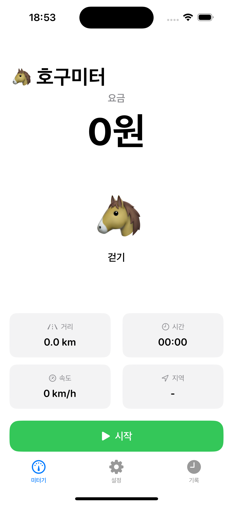
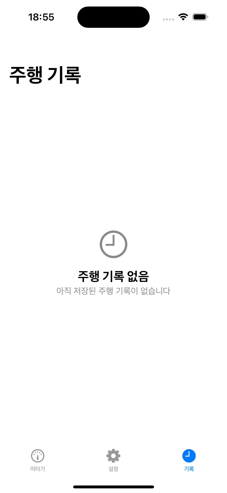
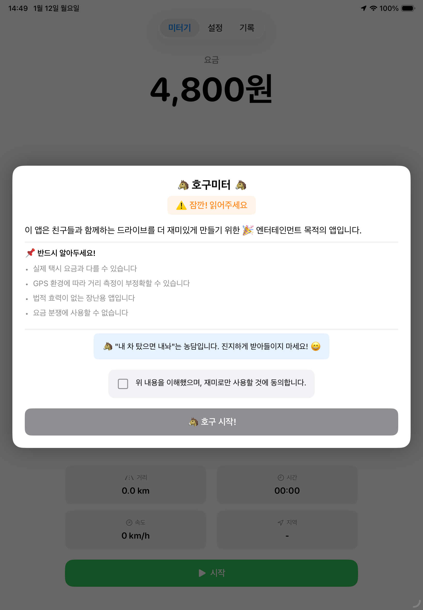

# 🐴 호구미터 (HoguMeter)

> **"내 차 탔으면 내놔"**
>
> 친구들과 함께하는 드라이브를 더 재미있게 만들어주는 장난스러운 택시미터기 앱

<p align="center">
  
  
  
  
</p>

### iPad 스크린샷
<p align="center">
  
</p>

---

## 📱 앱 소개

| 항목 | 내용 |
|-----|------|
| **앱 이름** | 호구미터 (HoguMeter) |
| **플랫폼** | iOS (iPhone + iPad) |
| **최소 지원 버전** | iOS 17.0+ |
| **기술 스택** | Swift 5.9+, SwiftUI, Core Location |
| **개발 상태** | ✅ MVP 완료 |

---

## ✨ 주요 기능

### 1. 실시간 택시 미터기
- GPS 기반 거리/시간 요금 계산
- 시작/정지/리셋 컨트롤

### 2. 병산제 요금 계산
실제 택시 미터기와 동일한 **병산제** 적용:
- **고속** (15.72km/h 이상): 거리로 계산 (131m당 100원)
- **저속/정차**: 시간으로 계산 (30초당 100원)
- **기본요금에 약 12유닛 포함** (1.6km 또는 6분)

### 3. 시간대별 요금
서울시 택시요금 체계 (2024년 기준):
- **주간** (04:00 ~ 22:00): 기본 4,800원
- **심야1** (22:00 ~ 23:00, 02:00 ~ 04:00): 20% 할증
- **심야2** (23:00 ~ 02:00): 40% 할증

### 4. 지역별 요금 설정
- 기본 서울시 택시요금 제공
- 사용자 지정 요금 추가/수정/삭제
- 지역 변경 시 자동 할증

### 5. 말 애니메이션
- 속도에 따라 변하는 이모지 애니메이션
- 고속 주행 시 스피드 효과

### 6. 영수증 캡쳐
- 상세 요금 내역 영수증 생성
- 사진첩에 바로 저장 (Core Graphics 고속 렌더링)

### 7. 주행 기록
- 모든 주행 기록 자동 저장
- 기록 상세 보기 및 삭제

### 8. 효과음
- iOS 시스템 사운드 연동
- 시작/정지/요금 변경 알림

### 9. 지도 보기
- Apple Maps 기반 실시간 지도 표시
- 커스텀 마커로 현재 위치 표시 (속도별 이모지 변경)
- GPS 경로 폴리라인 (이동 궤적)
- 자동 줌 기능 (속도에 따라 줌 레벨 자동 조정)
- 현재 위치 추적 버튼 (더블탭으로 방향 추적 모드)
- 마커가 이동 방향(heading)을 바라보며 회전

### 10. 면책 안내 마키 텍스트
- 미터기 작동 중 배경에 면책 문구 표시
- "이 앱의 미터기 정보는 엔터테인먼트용입니다"
- 오른쪽에서 왼쪽으로 흐르는 마키 애니메이션
- 실제 택시미터기가 아님을 명확히 알림

### 11. 이스터에그
특정 조건 달성 시 숨겨진 재미 요소 발동:
| 조건 | 이벤트 |
|------|--------|
| 88km/h 3초 유지 | ⚡🚗 "백 투 더 퓨처!" |
| 요금 12,345원 | 🌈 "연속 숫자!" |
| 00:00 출발 | 🎃🏰 "신데렐라 모드" |
| 거리 42.195km | 🏃‍♂️🏅 "마라톤 완주!" |
| 요금 4,444원 | 🍀 "행운의 숫자!" |
| 100km/h 이상 | 🚀 "광속 호구!" |
| 요금 10,000원 | 💰 "만원의 행복" |

### 12. 택시기사 한마디
- 주행 시작 시 랜덤 택시기사 멘트 표시
- 시간대별 특별 멘트 (새벽, 출근길, 퇴근길 등)
- 30가지 다양한 재미있는 멘트
- 영수증에 택시기사 한마디 저장

### 13. GPS 신호 손실 감지 & Dead Reckoning
터널 등 GPS 신호가 약하거나 손실된 상황에서도 정확한 거리 측정:

| 기능 | 설명 |
|------|------|
| **GPS 신호 상태 감지** | 정상(< 30m) / 약함(30~100m) / 손실(> 100m) |
| **Dead Reckoning** | GPS 손실 시 마지막 속도 기반 거리 추정 |
| **최대 지속 시간** | 180초 (3분) 후 자동 만료 |
| **속도 제한** | 최소 5km/h, 최대 200km/h |
| **상태 표시** | UI에 GPS 신호 상태 아이콘 표시 |

### 14. 무이동 감지 (Idle Detection)
미터기 실행 중 장시간 이동이 없을 경우 알림:

| 설정 | 값 | 설명 |
|------|-----|------|
| **무이동 기준 시간** | 10분 | 이동 없이 10분 경과 시 알림 |
| **이동 판단 거리** | 50m | 50m 이상 이동 시 타이머 리셋 |
| **체크 간격** | 30초 | 30초마다 무이동 상태 확인 |
| **최소 GPS 정확도** | 30m | 정확도 30m 초과 시 이동으로 인정 안 함 |
| **GPS 점프 필터** | 200km/h | 비현실적 속도는 GPS 점프로 판단 |

- 알림 시 "계속" 또는 "종료" 선택 가능
- "계속" 선택 시 모니터링 재개, "종료" 선택 시 미터기 정지
- **백그라운드 알림 지원**: 앱이 백그라운드일 때도 시스템 알림 표시
- **실내 GPS 점프 필터링**: 실내에서 GPS 점프로 인한 오작동 방지

---

## ✅ 구현 현황

| Epic | 설명 | 상태 |
|------|------|------|
| Epic 0 | 앱 초기 설정 | 🟢 Done |
| Epic 1 | 미터기 핵심 기능 | 🟢 Done |
| Epic 2 | 말 애니메이션 | 🟢 Done |
| Epic 3 | 요금 설정 | 🟢 Done |
| Epic 4 | 영수증/캡쳐 | 🟢 Done |
| Epic 5 | 효과음 | 🟢 Done |
| Epic 6 | 주행 기록 | 🟢 Done |
| Epic 7 | 설정 | 🟢 Done |
| Epic 8 | 지도 보기 | 🟢 Done |
| Epic 9 | 면책 안내 마키 텍스트 | 🟢 Done |
| Epic 10 | 재미 요소 (이스터에그) | 🟢 Done |

---

## 🏗️ 프로젝트 구조

```
HoguMeter/
├── HoguMeter/
│   ├── App/                    # 앱 진입점
│   ├── Core/                   # 코어 유틸리티
│   │   ├── Extensions/         # Swift 확장
│   │   └── Utils/              # 유틸리티 클래스
│   ├── Data/                   # 데이터 레이어
│   │   └── Repositories/       # Repository 구현
│   ├── Domain/                 # 도메인 레이어
│   │   ├── Entities/           # 도메인 엔티티 (GPSSignalState, DeadReckoningState 등)
│   │   └── Services/           # 도메인 서비스 (LocationService, DeadReckoningService, IdleDetectionService 등)
│   ├── Presentation/           # 프레젠테이션 레이어
│   │   ├── ViewModels/         # ViewModel
│   │   └── Views/              # SwiftUI View
│   └── Resources/              # 리소스 파일
├── HoguMeterTests/             # 단위 테스트
│   ├── Unit/                   # 단위 테스트
│   │   ├── FareCalculatorTests.swift
│   │   ├── FareTimeZoneTests.swift
│   │   ├── GPSSignalStateTests.swift
│   │   ├── DeadReckoningServiceTests.swift
│   │   ├── LocationServiceTests.swift
│   │   ├── RouteManagerTests.swift
│   │   └── IdleDetectionServiceTests.swift
│   └── Mocks/                  # Mock 클래스
│       ├── MockDeadReckoningService.swift
│       └── MockCLLocationManager.swift
├── docs/                       # 프로젝트 문서
│   └── QA_TEST_CASES.md        # QA 테스트 케이스
└── tasks/                      # Epic별 개발 태스크
```

---

## 📚 문서

| 문서 | 설명 |
|-----|------|
| [PROJECT_BRIEF.md](./docs/PROJECT_BRIEF.md) | 프로젝트 개요, 비전, 목표 |
| [PRD.md](./docs/PRD.md) | 상세 기능 요구사항 |
| [ARCHITECTURE.md](./docs/ARCHITECTURE.md) | 기술 아키텍처 |
| [DEVELOPMENT_GUIDE.md](./docs/DEVELOPMENT_GUIDE.md) | 개발 가이드 |
| [DEVELOPMENT_GUIDE-FOR-AI.md](./docs/DEVELOPMENT_GUIDE-FOR-AI.md) | AI 개발 가이드 |
| [PRIVACY_POLICY.md](./docs/PRIVACY_POLICY.md) | 개인정보 처리방침 (한글) |
| [PRIVACY_POLICY_EN.md](./docs/PRIVACY_POLICY_EN.md) | Privacy Policy (English) |
| [QA_TEST_CASES.md](./docs/QA_TEST_CASES.md) | GPS 기능 QA 테스트 케이스 |
| [tasks/README.md](./tasks/README.md) | 태스크 관리 |

---

## 🚀 시작하기

### 개발 환경 요구사항
- **Xcode**: 15.0+
- **Swift**: 5.9+
- **iOS Deployment Target**: 17.0+
- **macOS**: 14.0+ (Sonoma)

### 프로젝트 실행

```bash
# 1. 저장소 클론
git clone [repository-url]
cd hogumeter

# 2. Xcode에서 프로젝트 열기
open HoguMeter.xcodeproj

# 3. 시뮬레이터 선택 후 실행 (⌘ + R)
```

### Claude Code로 개발하기

```bash
# Claude Code 실행
claude

# AI와 대화하며 개발
> tasks/epic-1-meter-core/ 폴더를 읽고 미터기 기능을 확인해줘
> 영수증 캡쳐 기능을 개선해줘
```

---

## 🛠️ 기술 스택

| 카테고리 | 기술 |
|---------|------|
| Language | Swift 5.9+ |
| UI | SwiftUI (iOS 17+) |
| 아키텍처 | Clean Architecture + MVVM |
| 위치 | Core Location |
| 지도 | MapKit |
| 저장 | UserDefaults, Codable |
| 이미지 생성 | Core Graphics |
| 상태 관리 | @Observable (iOS 17+) |

---

## 📱 지원 기기

- **iPhone**: iPhone 12 이상 권장
- **iPad**: iPad Air, iPad Pro 등 전 모델 지원
- **iOS/iPadOS**: 17.0 이상
- **화면**: 모든 iPhone/iPad 크기 지원 (반응형 레이아웃)

---

## 🔧 최근 업데이트 (2026-01-13)

### 🔔 무이동 감지 기능 대폭 개선
미터기 실행 중 장시간 이동이 없을 경우 알림 기능을 전면 개선했습니다.

#### 수정된 버그
| 이슈 | 설명 | 해결 |
|------|------|------|
| **Alert 바인딩** | SwiftUI @Observable과 수동 Binding 호환 문제 | `showIdleAlertBinding` 프로퍼티 추가 |
| **상태 전이 누락** | `.alerted` 상태가 사용되지 않음 | `markAlerted()` 메서드 추가 |
| **실내 GPS 점프** | 실내에서 GPS 점프로 인한 타이머 리셋 | GPS 정확도 및 속도 필터링 추가 |
| **Dead Reckoning 차단** | GPS 손실 시 idle 감지 완전 비활성화 | Dead Reckoning 중에도 idle 체크 수행 |
| **백그라운드 알림** | 시스템 알림이 표시되지 않음 | 알림 권한 실시간 확인 방식으로 변경 |

#### 새로운 GPS 필터링
| 설정 | 값 | 설명 |
|------|-----|------|
| **최소 GPS 정확도** | 30m | 정확도 30m 초과 시 이동으로 인정 안 함 |
| **최대 현실적 속도** | 200km/h | 200km/h 초과 이동은 GPS 점프로 판단 |

#### 백그라운드 알림 지원
- 앱이 백그라운드에 있을 때도 시스템 알림으로 무이동 감지
- 알림에서 바로 "계속" 또는 "종료" 선택 가능
- 알림 권한 실시간 확인으로 안정성 향상

### 🔋 GPS 배터리 최적화
- **미터기 시작 전 GPS 비활성화**: 앱 실행만으로 GPS가 켜지지 않음
- **미터기 시작 시에만 GPS 활성화**: 배터리 소모 최소화
- **미터기 종료 시 GPS 즉시 비활성화**

---

## 🔧 이전 업데이트 (2026-01-12)

### 📱 iPad 지원 추가
iPad에서도 호구미터를 사용할 수 있게 되었습니다!

| 항목 | 내용 |
|------|------|
| **지원 기기** | iPad Air, iPad Pro 등 전 모델 |
| **화면 방향** | 세로/가로 모두 지원 (멀티태스킹 호환) |
| **레이아웃** | 반응형 UI로 모든 화면 크기에 최적화 |

### 🎨 반응형 레이아웃 개선
- **GeometryReader 기반 동적 레이아웃**: 화면 크기에 따라 자동 조정
- **요금 표시**: 상단 고정
- **말 애니메이션**: 화면 중앙 배치
- **주행 정보/버튼**: 하단 고정
- **마키 텍스트**: 말 애니메이션 영역에만 표시 (겹침 방지)

### 🚕 택시기사 한마디 UI 개선
- **상단 알림 형태**: 화면 상단에서 내려왔다가 올라가는 애니메이션
- **동적 표시 시간**: 메시지 길이에 따라 5~10초 자동 조절
- **탭하여 닫기**: 알림을 탭하면 즉시 사라짐

### 🔧 App Store 검증 수정
- iPad용 앱 아이콘 추가 (76x76@2x, 83.5x83.5@2x 등)
- iPad 멀티태스킹 방향 지원 추가

---

## 🔧 이전 업데이트 (2025-12-22)

### ⏱️ 무이동 감지 (Idle Detection)
미터기 실행 중 장시간 이동이 없을 경우 알림:
- **IdleDetectionService**: 10분간 50m 이상 이동 없으면 알림 표시
- **Dead Reckoning 연동**: GPS 손실 중에는 무이동 감지 일시 중지
- **알림 UI**: "계속" 또는 "종료" 선택 가능
- 30초 간격으로 무이동 상태 확인

### 📡 GPS 신호 손실 감지 & Dead Reckoning
터널 등 GPS 신호가 약하거나 손실된 상황에서도 정확한 거리 측정:
- **GPSSignalState**: 정확도 기반 신호 상태 판별 (정상/약함/손실)
- **DeadReckoningService**: GPS 손실 시 마지막 속도 기반 거리 추정
- **LocationService 통합**: GPS 상태 변화 감지 및 Dead Reckoning 자동 시작/중지
- 최대 180초 동안 추정, 이후 자동 만료
- 속도 범위: 최소 5km/h ~ 최대 200km/h

### 🗺️ 영수증 지도 표시 버그 수정
- 영수증 뷰에서 지도가 빈 화면으로 표시되던 문제 수정
- MKMapSnapshotter를 사용한 실시간 지도 타일 로딩
- 경로 폴리라인 및 출발/도착 마커 오버레이

### 🧪 테스트 커버리지 확대
GPS 관련 기능에 대한 포괄적인 단위 테스트 추가:
- `GPSSignalStateTests`: 신호 상태 판별 및 경계값 테스트
- `DeadReckoningServiceTests`: 거리 추정 로직 테스트
- `LocationServiceTests`: GPS 시나리오 통합 테스트
- `IdleDetectionServiceTests`: 무이동 감지 로직 테스트
- Mock 클래스: `MockDeadReckoningService`, `MockLocationServiceForGPS`, `MockCLLocationManager`

---

## 🔧 이전 업데이트 (2025-12-16)

### 🚕 TASK-10.2: 택시기사 한마디
- 주행 시작 시 랜덤 택시기사 멘트 표시
- 시간대별 특별 멘트 지원
  - 새벽 (00:00~05:00): "이 시간에 어디 가세요?"
  - 출근길 (07:00~09:00): "출근길 화이팅!"
  - 점심 (11:30~13:00): "점심은 드셨어요?"
  - 퇴근길 (18:00~20:00): "퇴근 수고하셨어요~"
- 30가지 다양한 재미있는 멘트
- 영수증에 택시기사 한마디 저장

### 🗺️ 지도 기능 개선
- **방향 추적 모드**: 현재위치 버튼 더블탭 시 지도가 단말기 방향에 따라 회전
- **마커 위치 개선**: 마커가 정확한 좌표 위치에 표시
- **마커 회전**: 이동 방향(heading)을 바라보며 회전
- **속도별 마커 이모지**:
  | 속도 | 상태 | 이모지 |
  |------|------|--------|
  | 0 km/h | 숨 돌리기 | 💤 |
  | 0-5 km/h | 걷기 | 🐴 |
  | 5-10 km/h | 빠른 걸음 | 🐎 |
  | 10-30 km/h | 달리기 | 🏇 |
  | 30-100 km/h | 질주본능 발휘 | 🔥 |
  | 100+ km/h | 로켓포 발사 | 🚀 |

### 🎉 Epic 10: 이스터에그 (TASK-10.6)
특정 조건 달성 시 숨겨진 재미 요소 발동:
- ⚡🚗 백 투 더 퓨처 (88km/h 3초 유지)
- 🌈 연속 숫자 (요금 12,345원)
- 🎃🏰 신데렐라 모드 (00:00 출발)
- 🏃‍♂️🏅 마라톤 완주 (거리 42.195km)
- 🍀 행운의 숫자 (요금 4,444원)
- 🚀 광속 호구 (100km/h 이상)
- 💰 만원의 행복 (요금 10,000원)

### 📜 Epic 9: 면책 안내 마키 텍스트
- 미터기 작동 중 배경에 면책 문구 표시
- 오른쪽에서 왼쪽으로 흐르는 마키 애니메이션

### 🐛 버그 수정
- 속도가 0까지 내려가지 않는 문제 수정 (3초 타임아웃 추가)
- 영수증 팝업이 즉시 사라지는 문제 수정
- 요금 표시 세자리 콤마(,) 추가

---

## 📦 빌드

```bash
# Simulator용 빌드
xcodebuild -project HoguMeter.xcodeproj \
  -scheme HoguMeter \
  -sdk iphonesimulator \
  -destination 'platform=iOS Simulator,name=iPhone 16' \
  build
```

---

## 📄 라이선스

MIT License

---

## 📞 연락처

프로젝트 관련 문의: imdevbada@gmail.com

---

> 🐴 **"호구미터와 함께라면, 모든 드라이브가 즐거워집니다!"**
